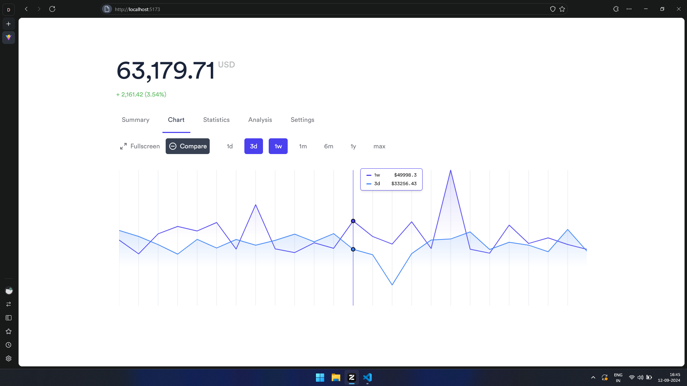

# Frontend Developer Assignment - Catalog

This is my submission for the Frontend Developer assignment at Catalog. The project involves converting a Figma wireframe into a functional web component using React.

## Live Demo

View the live project [here](https://catalog-task-eta.vercel.app/).

## Features

- Responsive design
- Use of third-party libraries
- Modular and reusable components

## Technologies Used

- **React** with **Vite** for development
- **CSS/Tailwind CSS** for styling
- Additional libraries

## Screenshot



## Installation

1. Clone the repository:

   ```bash
   git clone https://github.com/KreativeND/catalog-task.git
   cd catalog-task
   ```

2. Install dependencies:

   ```bash
   npm install
   ```

3. Run the development server:

   ```bash
   npm run dev
   ```

4. Open your browser and navigate to:

   ```plaintext
   http://localhost:5173
   ```


## Contact

For questions or feedback, reach out at [nirajdasari@yahoo.com](mailto:nirajdasari@yahoo.com).

---

Thanks for reviewing my submission!